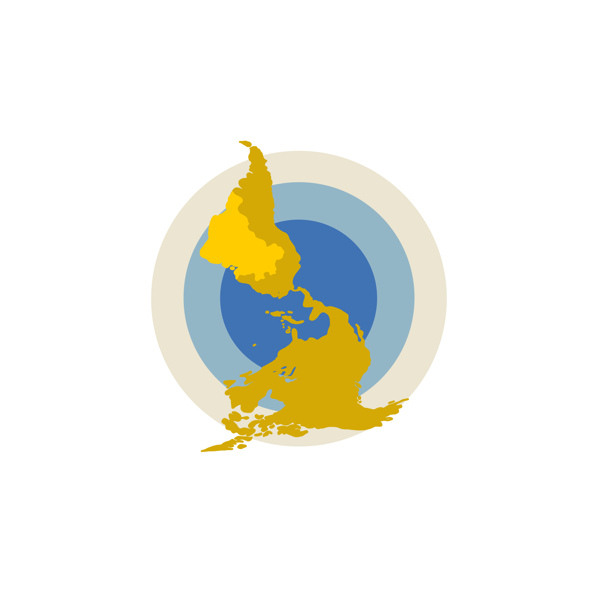

# The Americas and the World | Brazilian Branch

Here you find data from the research project Brazil, the Americas and the World, a branch of the international collaborative program _Las Americas y el Mundo_ (The Americas and the World) based on the _Centro de Investigaciones en Desarrollo Económico -- CIDE_ ( Center for Economic Development Research) at Mexico DF. 
Las Americas and the World is the only encompassing study of elites’ and mass public’s opinions about international issues in Latin America.
Brazil, the Americas, and the World is funded by The São Paulo Research Foundation (FAPESP) and hosted by the Brazilian Center of Analysis and Planning (Cebrap).

 

 

# Research Team

<ul>

<li> <a href="http://lattes.cnpq.br/4797882536342819" target="_blank" rel="external"> Maria Hermínia Tavares de Almeida </a>, coordinator (Cebrap) 
 
</li>
 
<li> <a href="https://sites.google.com/site/ivanfilipefernandes/" target="_blank" rel="external"> Ivan Lopes Fernandes </a> (Federal University of ABC- UFABC)
 
</li>
 
<li> <a href="http://lattes.cnpq.br/7107955008495284" target="_blank" rel="external"> Feliciano de Sá Guimarães </a> (University of São Paulo - USP)
 
</li>
 
<li> <a href="http://lattes.cnpq.br/1920255833804512" target="_blank" rel="external"> Flávio Leão Pinheiro </a> (Federal University of ABC- UFABC)
 
</li>
 
<li> <a href="http://lattes.cnpq.br/6121326952317794" target="_blank" rel="external"> Leandro Piquet Carneiro </a> (University of São Paulo - USP)
 
</li>
 
<li> <a href="https://umbertomig.com/" target="_blank" rel="external"> Umberto Mignozzetti </a> (Emory University)
 
</li>
 
<li> <a href="http://lattes.cnpq.br/3708102324198107" target="_blank" rel="external"> Janina Onuki </a>, associate researcher (University of São Paulo - USP)
 
</li>

</ul>
 

## Research Assistants

<li> Priscila Petris </li>
<li> Paloma Morais </li>
<li> Fernando Favalle </li>
<li> <a href="https://catarinaroman.github.io/" target="_blank" rel="external"> Catarina Roman </a> </li>
<li> Cicley Dias </li>
<li> Giovanna França </li>
<li> Ingrid Meirelles </li>
 

## Collaborators

<li> Anna Carolina Mello </li>
<li> Bruno Castro </li>
<li> Caique Terenzzo </li>
 
 

# The Project 

 Brazil, the Americas, and the World aims at studying the perceptions of the mass public and the elites regarding international affairs and foreign policy issues. It comprises three related subprojects:

1. A panel survey with the mass public and social and political elites was conducted every four years (2010, 2015, 2019);
2. The Foreign Policy at Press Observatory follows the debate on Brazilian foreign policy in major press outlets through collecting and cataloging editorials and op-ed columns;
3. A survey experiment on how mass public preferences for foreign policies influence the opinions of the elites on these issues.

All the data collected in the survey waves conducted by the international teams of the _Las Americas y el Mundo_ in Mexico, Peru, Chile, Colombia, and Argentina and data collected for the _Foreign Policy at Press Observatory_ are available online on this page. You may find the issues of _Foreign Policy at Press Observatory_ at [CEBRAP's webpage](http://cebrap.org.br/projetos/observatorio/).

# Databases and Codebooks

## 2019

The dataset for the 2019 Brazilian wave of the survey can be downloaded [here](https://github.com/catarinaroman/las-americas/blob/main/2019-files/2019-database.csv)

The corresponding codebook follows below:
<iframe src="https://drive.google.com/file/d/1hLDwlvfEoPG6_gxILRgOZKBv7rng_azw/preview" width="600" height="480"></iframe>

If your browser does not support pdfs, you can download the 2019 codebook [here](https://drive.google.com/file/d/1hLDwlvfEoPG6_gxILRgOZKBv7rng_azw/view?usp=sharing).

The 2019 survey instrument (questionnaire) is available in [this link](https://github.com/catarinaroman/las-americas/blob/main/surveys/brazil-2019-survey.pdf).

## 2014

The dataset for the 2014 Brazilian wave of the survey can be downloaded [here](https://github.com/catarinaroman/las-americas/blob/main/2014-files/2014-database.csv).
The corresponding codebook follows below:

If your browser does not support pdfs, you can download the 2014 codebook [here]().

The 2014 survey instrument (questionnaire) is available in [this link](https://github.com/catarinaroman/las-americas/blob/main/surveys/brazil-2014-survey.pdf).

## 2010

The dataset for the 2010 Brazilian wave of the survey can be downloaded [here]().
The corresponding codebook follows below:

If your browser does not support pdfs, you can download the 2010 codebook [here]().

The 2010 survey instrument (questionnaire) is available in [this link](https://github.com/catarinaroman/las-americas/blob/main/surveys/brazil-2010-survey.pdf).
