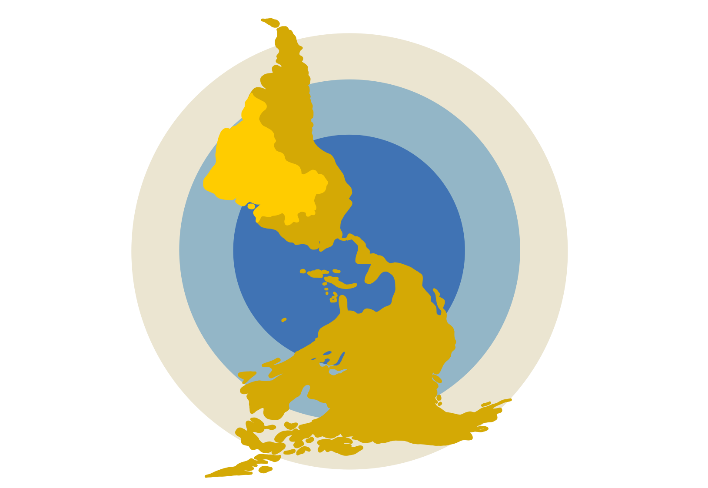

# Brazil, the Americas and the World

Here you find data from the research project Brazil, the Americas and the World, a branch of the international collaborative program _Las Americas y el Mundo_ (The Americas and the World) based on the _Centro de Investigaciones en Desarrollo Económico -- CIDE_ ( Center for Economic Development Research) at Mexico DF. 
Las Americas and the World is the only encompassing study of elites’ and mass public’s opinions about international issues in Latin America.
Brazil, the Americas, and the World is funded by The São Paulo Research Foundation (FAPESP) and hosted by the Brazilian Center of Analysis and Planning (Cebrap).

# Research Team

<ul>

<li> <a href="http://lattes.cnpq.br/4797882536342819" target="_blank" rel="external"> Maria Hermínia Tavares de Almeida </a>, coordinator (Cebrap) 
 
</li>
 
<li> <a href="https://sites.google.com/site/ivanfilipefernandes/" target="_blank" rel="external"> Ivan Lopes Fernandes </a> (Federal University of ABC- UFABC)
 
</li>
 
<li> <a href="http://lattes.cnpq.br/7107955008495284" target="_blank" rel="external"> Feliciano de Sá Guimarães </a> (University of São Paulo - USP)
 
</li>
 
<li> <a href="http://lattes.cnpq.br/1920255833804512" target="_blank" rel="external"> Flávio Leão Pinheiro </a> (Federal University of ABC- UFABC)
 
</li>
 
<li> <a href="http://lattes.cnpq.br/6121326952317794" target="_blank" rel="external"> Leandro Piquet Carneiro </a> (University of São Paulo - USP)
 
</li>
 
<li> <a href="https://umbertomig.com/" target="_blank" rel="external"> Umberto Mignozzetti </a> (Emory University)
 
</li>
 
<li> <a href="http://lattes.cnpq.br/3708102324198107" target="_blank" rel="external"> Janina Onuki </a>, associate researcher (University of São Paulo - USP)
 
</li>

</ul>
 

## Research Assistants

<li> Priscila Petris </li>
<li> Paloma Morais </li>
<li> Fernando Favalle </li>
<li> <a href="https://catarinaroman.github.io/" target="_blank" rel="external"> Catarina Roman </a> </li>
<li> Cicley Dias </li>
<li> Giovanna França </li>
<li> Ingrid Meirelles </li>
<li> Juliana Santos </li>
<li> Caique Terenzzo </li>
 

## Research Associates

<li> Anna Carolina Mello </li>
<li> Bruno Castro </li>
 
 

# The Project 

 Brazil, the Americas, and the World aims at studying the perceptions of the mass public and the elites regarding international affairs and foreign policy issues. It comprises three related subprojects:

1. A panel survey with the mass public and social and political elites was conducted every four years (2010, 2015, 2019);
2. The Foreign Policy at Press Observatory follows the debate on Brazilian foreign policy in major press outlets through collecting and cataloging editorials and op-ed columns;
3. A survey experiment on how mass public preferences for foreign policies influence the opinions of the elites on these issues.

All the data collected in the survey waves conducted by the international teams of the _Las Americas y el Mundo_ in Mexico, Peru, Chile, Colombia, and Argentina and data collected for the _Foreign Policy at Press Observatory_ are available online on this page. You may find the issues of _Observatory of Brazilian Foreign Policy in the Press_ at [CEBRAP's webpage](http://cebrap.org.br/projetos/observatorio/).

# Databases and Codebooks

## 2019

The dataset for the 2019 Brazilian wave of the survey can be downloaded [here](https://github.com/catarinaroman/las-americas/blob/main/2019-files/2019-database.csv)

The corresponding codebook follows below:
<iframe src="https://drive.google.com/file/d/1hLDwlvfEoPG6_gxILRgOZKBv7rng_azw/preview" width="600" height="480"></iframe>

If your browser does not support pdfs, you can download the 2019 codebook [here](https://drive.google.com/file/d/1hLDwlvfEoPG6_gxILRgOZKBv7rng_azw/view?usp=sharing).

The 2019 survey instrument (questionnaire) is available in [this link](https://github.com/catarinaroman/las-americas/blob/main/surveys/brazil-2019-survey.pdf).

## 2014

The dataset for the 2014 Brazilian wave of the survey can be downloaded [here](https://github.com/catarinaroman/las-americas/blob/main/2014-files/2014-database.csv).
The corresponding codebook follows below:

If your browser does not support pdfs, you can download the 2014 codebook [here]().

The 2014 survey instrument (questionnaire) is available in [this link](https://github.com/catarinaroman/las-americas/blob/main/surveys/brazil-2014-survey.pdf).

## 2011

The dataset for the 2011 leadership survey can be dowloaded [here](https://github.com/catarinaroman/las-americas/tree/main/2011-files)
The corresponding codebook follows below:

If your browser does not support pdfs, you can download the 2011 codebook [here]().

The 2010 survey instrument (questionnaire) is available in [this link](https://github.com/catarinaroman/las-americas/tree/main/2011-files).

## 2010

The dataset for the 2010 Brazilian wave of the survey can be downloaded [here]().
The corresponding codebook follows below:

If your browser does not support pdfs, you can download the 2010 codebook [here]().

The 2010 survey instrument (questionnaire) is available in [this link](https://github.com/catarinaroman/las-americas/blob/main/surveys/brazil-2010-survey.pdf).

# Observatory of Brazilian Foreign Policy in the Press

<li> What is the _Foreign Policy at Press Observatory_?
 
Durante décadas, a política externa brasileira não fez parte da agenda pública de debates. Ao contrário, formulada e executada pelo Ministério de Relações Exteriores, como maior ou menor protagonismo da Presidência da República ela foi, tipicamente, uma política produzida em situação de insulamento burocrático, possibilitado pela indiferença das lideranças políticas e sociais e da opinião pública, ou da parcela mais envolvida na discussão política nacional. Esta situação vem mudando, nas últimas duas décadas. Embora o Itamaraty continue ocupando o centro nervoso, que comanda a política externa brasileira, ela já não pode mais ser pensada como resultado de decisões tomadas por poucos, a portas fechadas. Assim, sua condição de política de estado começa a depender crescentemente, não só da disciplina e capacidade de uma elite burocrática treinada para pensar o país no mundo, mas, também dos consensos formados entre os participantes do que o cientista político Amaury de Souza denominou, anos atrás, “comunidade de política externa” e da capacidade desta de produzir visões sobre a ação externa do Brasil compartilhadas pelo público. A medida em que se alargou o círculo dos que acompanham e se interessam pela ação externa do país, as opiniões sobre ela se diversificaram e com frequência divergiram. Hoje, a imprensa escrita é, a um só tempo, arena e protagonista de um debate informado sobre a política exterior do país. Por esta razão, decidimos acompanhar o que pensam e dizem sobre o tema os principais órgãos da imprensa escrita, como protagonistas, em seus editoriais, e como meio, nos artigos assinados por seus colaboradores permanentes e eventuais. Nossa equipe de pesquisadores lê, cataloga e organiza de forma temática artigos assinados e editoriais publicados na imprensa diária de maior circulação. Acompanhamos, simultaneamente, os pronunciamentos de autoridades do primeiro escalão – Presidente, Vice-presidente, Ministro das Relações Exteriores — sobre a política externa brasileira. As informações mais importantes são publicadas aqui, a cada semestre. Este boletim e o levantamento que o alimenta são realizados pelo Grupo de Pesquisa Imprensa, Opinião Pública e Política Externa e faz parte do projeto O Brasil, as Américas e o Mundo, uma parceria entre Instituto de Relações Internacionais da Universidade de São Paulo e o CEBRAP, com apoio da Fundação de Amparo à Pesquisa do Estado de São Paulo.
</li>

<li> Methodology
 
Nossa equipe de pesquisadores lê, cataloga e organiza de forma temática, em um banco de dados, artigos assinados, entrevistas com especialistas e editoriais publicados na imprensa diária ou semanal de maior circulação: Folha de S. Paulo, O Globo, O Estado de S. Paulo e Valor Econômico. Recentemente adicionamos o jornal exclusivamente digital, Gazeta do Povo. Além de registrar a posição expressa em cada texto sobre a política externa brasileira, acompanhamos uma série de temas específicos relacionados às orientações e grandes linhas de atuação do governo no plano internacional. Classificamos como contrários à política externa os textos que a ela fazem críticas explicitas e favoráveis aqueles que explicitamente a elogiam. O termômetro CEBRAP, que visa medir o grau de apoio à política externa brasileira, toma em consideração apenas artigos, entrevistas e editoriais que são explicitamente favoráveis à ação internacional do governo.
 </li>

